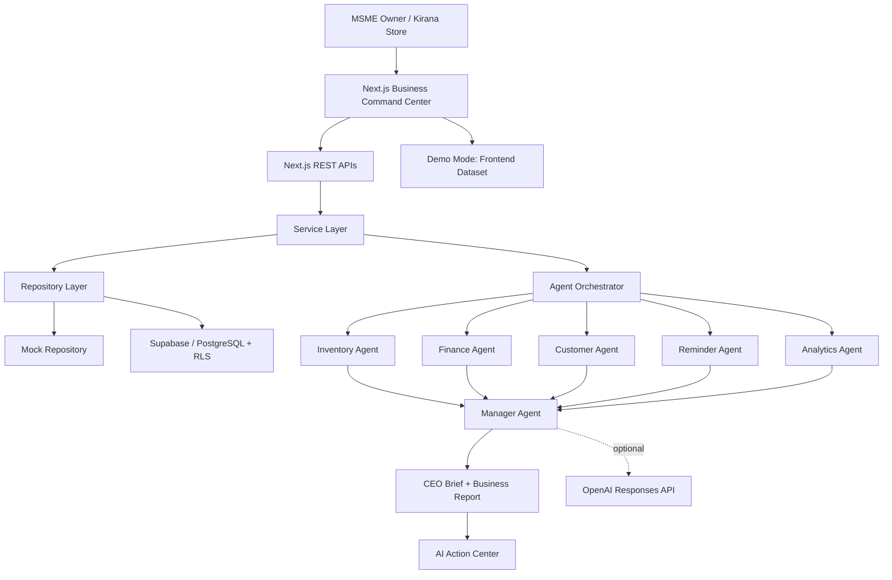

# VyapaarSathi AI — Hackathon Submission

## Problem Statement

Indian MSMEs are the backbone of local commerce, yet many owner-operators make important decisions with fragmented data. Sales are recorded separately from inventory, invoices are chased manually, expenses are hard to compare, and valuable customer patterns are missed. Existing software often reports what happened; it does not clearly explain what to do next.

## Solution

VyapaarSathi AI is an AI-powered Business Command Center designed for Indian MSMEs. It consolidates operational signals and turns them into an executive-ready CEO Brief, risk alerts, growth opportunities, and action tasks. A Kirana store owner can see the business health, understand the reason behind it, and execute a next step in one place.

## Key Features

- Business Health Dashboard with revenue, expenses, profit, pending payment, product, and activity views
- CEO-style command center with a Business Health Score, AI confidence, alerts, and priorities
- Multi-agent business analysis with explainable reasoning and confidence scores
- AI Growth Advisor for revenue opportunities, bundles, cross-sell, upsell, seasonal ideas, and fast/slow-moving products
- AI Action Center with simulated, auditable execution of operational tasks
- Inventory, invoices, customers, reports, reminders, and agent-log workflows
- Demo Mode that instantly loads a realistic Indian Kirana Store business
- Presentation Mode that narrates business insights for judges or stakeholders
- Professional PDF Business Report export
- Dark mode, responsive sidebar, and premium glassmorphism UI

## Tech Stack

| Layer | Technologies |
| --- | --- |
| Frontend | Next.js App Router, React, TypeScript, Tailwind CSS |
| Visualization | Recharts, jsPDF, Lucide Icons |
| Validation | Zod, React Hook Form |
| Backend | Next.js Route Handlers, service and repository layers |
| Data | Supabase-ready PostgreSQL schema, Row Level Security, mock repositories |
| AI | Deterministic specialist agents; optional OpenAI Responses API manager synthesis |

## Architecture



## Folder Structure

```text
app/                  Next.js pages and API routes
agents/               Deterministic specialist and manager agents
components/           Reusable UI and dashboard components
lib/                  Validation, Supabase clients, utilities, demo data
repositories/         Mock and Supabase repository implementations
services/             Orchestration, AI, business, and action services
supabase/migrations/  PostgreSQL schema and RLS migrations
types/                Shared domain and agent contracts
docs/                 API and hackathon documentation
```

## AI Agents

| Agent | Responsibility | Output |
| --- | --- | --- |
| Inventory Agent | Finds low-stock and stockout risks | Replenishment priorities |
| Finance Agent | Reviews revenue, expenses, profit, invoices | Cash-flow and collection actions |
| Customer Agent | Evaluates customer value and data completeness | Relationship follow-ups |
| Reminder Agent | Reviews pending and overdue reminders | Urgent task list |
| Analytics Agent | Identifies sales movement and patterns | Trend and product insight |
| Growth Advisor | Finds cross-sell, upsell, bundles, and seasonal plays | Revenue opportunities |
| Manager Agent | Runs specialists sequentially and synthesizes their outputs | CEO Brief and Business Report |

Every agent returns reasoning, confidence, execution time, recommendations, and structured data. This makes the system explainable instead of a black box.

## Innovation

1. **From dashboard to command center** — instead of showing only numbers, VyapaarSathi AI translates numbers into priorities and actions.
2. **Reliable hybrid intelligence** — deterministic business logic works without an API key; the Manager Agent can optionally add natural-language synthesis with OpenAI.
3. **Actionable AI, not just advice** — recommendations become operational tasks such as restock plans, payment reminders, and sales reports.
4. **Hackathon-ready narrative** — Demo Mode and Presentation Mode tell a credible business story in seconds.
5. **Designed for MSME realities** — simple language, INR formatting, Kirana Store demo data, cash-flow focus, and minimal setup.

## Future Scope

- WhatsApp and SMS delivery for approved reminders
- GST, UPI, POS, and accounting-software integrations
- OCR for supplier invoices and stock bills
- Voice-first Hindi and regional-language assistant
- Demand forecasting from historical sales and festivals
- Multi-store benchmarking and owner/employee permission controls
- Human approval workflow before external actions are sent
- Mobile app and offline-first inventory capture

## Installation Guide

### Prerequisites

- Node.js 20.9 or newer
- npm
- Optional: Supabase project and OpenAI API key

### Run locally

```bash
git clone <your-repository-url>
cd vyapaarsathi-ai
npm install
copy .env.example .env.local
npm run dev
```

### Run with deterministic mock data

Set `USE_MOCK_DATA=true` in `.env.local`. This supports a full demonstration without external services.

### Run with Supabase

1. Create a Supabase project.
2. Add your URL and keys to `.env.local`.
3. Apply SQL files in `supabase/migrations/` in chronological order.
4. Set `USE_MOCK_DATA=false`.

### Enable optional OpenAI manager synthesis

Set `OPENAI_API_KEY`. The Manager Agent will call the Responses API only after the deterministic specialists complete. Failures automatically use deterministic output.

## Demo Flow

1. Open the dashboard and click **Load Demo Business**.
2. Show the generated Kirana Store: 50 products, 30 customers, 100 sales, 20 expenses, 10 invoices, and 15 reminders.
3. Explain the Revenue, Expenses, Profit, and Pending Payment KPIs.
4. Highlight the top-selling products and low-stock inventory.
5. Click **Start Demo Mode** for the full-screen AI narrative.
6. Return to the command center and run the AI Board Meeting.
7. Open AI Action Center to show tasks for restock, follow-up, and reporting.
8. Download the AI Business Report PDF.

## Two-Minute Pitch

> Indian MSMEs run on energy, relationships, and instinct—but often without a clear real-time view of the business. A Kirana store owner may know that sales are happening, yet not know which product will stock out, which customer payment is overdue, or where the next profit opportunity is.
>
> VyapaarSathi AI is an AI Business Command Center built for that reality. It combines sales, inventory, expenses, invoices, customers, and reminders into one simple workspace. Our specialist agents review each operational area, explain their reasoning, and the Manager Agent turns that into a CEO Brief: what is healthy, what is risky, and what should be done next.
>
> The important difference is that VyapaarSathi AI does not stop at insight. It creates actionable tasks—restock plans, payment reminders, customer follow-ups, sales reports, and GST checklists. The owner stays in control, while AI reduces the time between noticing a problem and acting on it.
>
> For the hackathon, we created Demo Mode for a realistic Indian Kirana Store and Presentation Mode for a guided executive walkthrough. The system works reliably with deterministic logic, and can enrich the final CEO Brief through the OpenAI Responses API when configured.
>
> VyapaarSathi AI gives every MSME owner something normally reserved for larger companies: an always-on business co-pilot.

## Judge Q&A

1. **Who is the target user?**  
   Indian MSME owners, beginning with Kirana stores and local retail businesses.

2. **What pain point is solved?**  
   Fragmented business information that causes stockouts, poor cash collection, unclear profitability, and missed growth opportunities.

3. **Why not use a spreadsheet?**  
   Spreadsheets record data, but VyapaarSathi AI interprets it, prioritizes it, and proposes an action.

4. **What makes the AI explainable?**  
   Each agent emits reasoning, confidence, execution time, recommendations, and structured data.

5. **Does it work without OpenAI?**  
   Yes. Deterministic agents and mock data provide reliable outputs without any external AI dependency.

6. **Where is OpenAI used?**  
   Only by the Manager Agent, which turns specialist outputs into a structured CEO Brief.

7. **What happens if OpenAI fails?**  
   Retry and timeout handling are applied, then the system returns a deterministic fallback.

8. **How is data protected?**  
   The Supabase schema is designed with user-scoped data and Row Level Security policies.

9. **Can the system take actions automatically?**  
   It generates reviewable actions; future external messaging or purchase-order sending can remain approval-based.

10. **How does the product identify low stock?**  
    It compares recorded quantity with the reorder level and stock status.

11. **How is profit calculated?**  
    Tracked revenue minus recorded expenses, surfaced clearly in the health dashboard.

12. **What does Growth Advisor do?**  
    It identifies fast/slow movers and produces deterministic cross-sell, upsell, bundle, and seasonal recommendations.

13. **Why use multiple agents?**  
    Each business concern has a focused rule set, while the Manager Agent creates one coherent executive view.

14. **Can this support businesses other than Kirana stores?**  
    Yes. The core entities—products, sales, expenses, invoices, customers, and reminders—fit many small businesses.

15. **How does Demo Mode help?**  
    It lets judges evaluate the entire product instantly without setup, credentials, or data entry.

16. **What is Presentation Mode?**  
    A full-screen, auto-advancing explanation of the key business signals for owners, investors, or judges.

17. **What is the business model?**  
    A freemium SaaS model: basic tracking free, with paid AI insights, automated actions, integrations, and multi-store support.

18. **What is the biggest technical challenge?**  
    Combining deterministic reliability, AI narrative quality, and a UI simple enough for a non-technical owner.

19. **How can accuracy improve over time?**  
    By connecting POS, invoices, UPI, and supplier data, then learning seasonal and product-specific demand patterns.

20. **What is the long-term vision?**  
    To become the trusted AI operating layer for India’s small businesses—helping them make better decisions every day.

## License

This project is released under the MIT License. See [LICENSE](../LICENSE).
